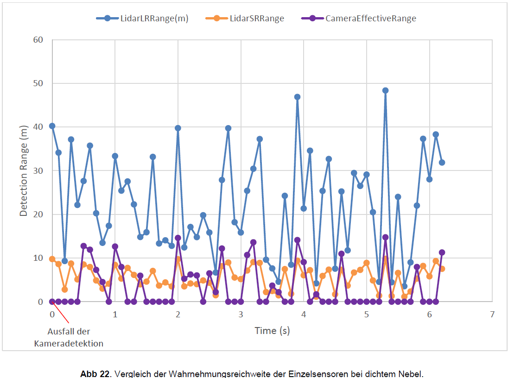
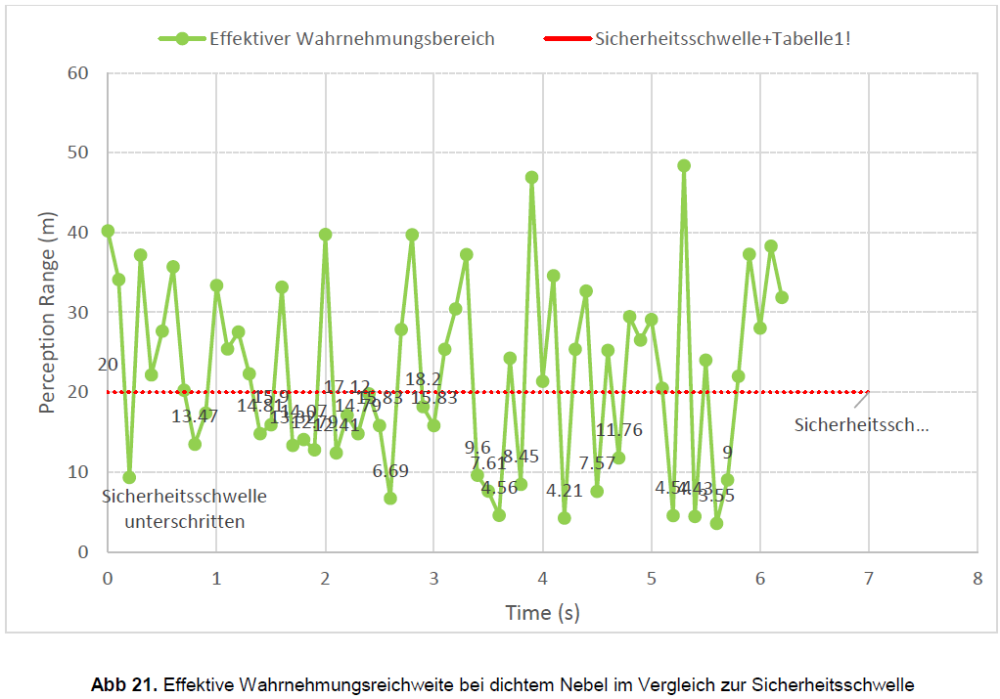
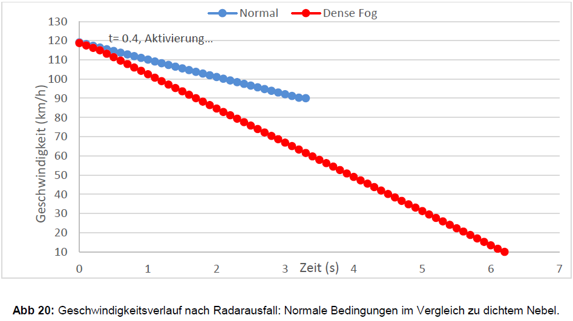
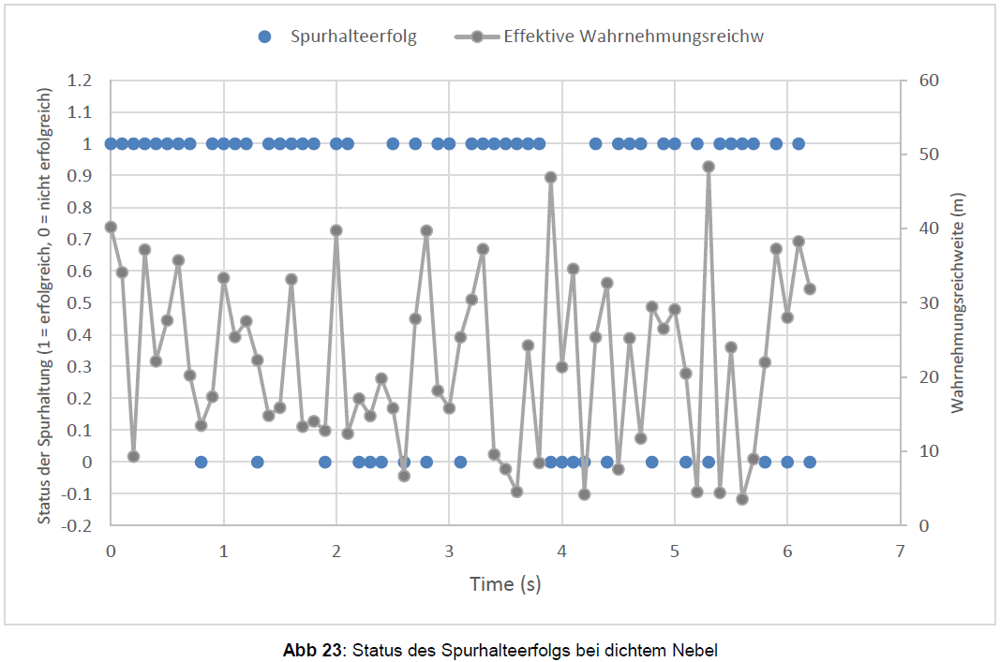

 [← Back to profile](https://github.com/Farzinpm) · [LinkedIn](https://www.linkedin.com/in/farzin-pezeshkimehr)
 
# Autonomous Vehicle Perception Under Sensor Failure
**Master Thesis | M.Eng. Automotive Engineering | Ostfalia Hochschule**

### 1. Scenario / Problem Statement
> **Note:** This study uses a Level-5 automation scenario as an academic
> simplification to isolate perception-safety behavior under sensor failure.
> Current production systems operate at lower automation levels with
> restricted operational design domains (ODD).

This study investigated the safety limitations of a Level-5 autonomous vehicle following a **complete radar sensor failure under dense fog conditions**.

The core question was whether the remaining **LiDAR and camera sensors** could maintain sufficient perception capability to safely continue the driving task when visibility was limited to **50 m**.

The scenario was deliberately designed as a combined **sensor failure + adverse weather condition**, creating a critical situation in which the remaining optical sensors were themselves subject to significant performance degradation.

### 2. Methodology & Approach

A Python-based simulation was developed to evaluate the impact of radar loss on autonomous vehicle perception and safety behavior.

The approach consisted of:

* Definition of a normal-weather baseline and a dense-fog failure scenario
* Complete failure injection of the radar system
* Modeling of LiDAR and camera performance degradation under dense fog
* Evaluation of object reflectivity and detection probability
* Modeling of sensor-fusion latency
* Assessment of perception quality and lane-keeping capability
* Definition of safety thresholds for triggering an emergency braking maneuver
* Analysis of the resulting vehicle response and transition toward a **Minimal Risk Condition (MRC)**
* Evaluation of the remaining sensor redundancy and identification of potential improvement strategies

### 3. Simulation & Python Implementation

The simulation was implemented in **Python** to model the interaction between sensor performance, environmental conditions and vehicle safety behavior.

The model included:

* Stochastic LiDAR detection-range generation based on object reflectivity
* Separate long-range and short-range LiDAR models
* Camera detection probability and effective detection range
* Sensor-fusion delays of **300–500 ms**
* Perception-quality calculation
* Lane-keeping evaluation
* Emergency-braking logic
* Vehicle deceleration and speed reduction
* CSV-based simulation data generation and analysis
* Statistical evaluation of sensor performance across different reflectivity classes

The simulation therefore connected **sensor degradation → perception quality → safety decision → vehicle response** within one analysis framework.
[View simulation source code](src/sensor_failure_simulation.py)

### 4. Parameters & Key Assumptions

Key simulation parameters included:

* Initial vehicle speed: **118.74 km/h**
* Target speed during emergency response: **10 km/h**
* Dense-fog visibility: **50 m**
* Perception-quality threshold: **0.30**
* Observed perception quality at emergency trigger: **0.25**
* Emergency trigger time: **0.4 s**
* Simulated deceleration: **−4.95 m/s²**
* Sensor-fusion latency in dense fog: **500 ms**
* Object reflectivity range: **0.11–0.98**
* Camera detection probability: **40 %**
* Lane-keeping threshold: **15 m**

For the LiDAR models, effective detection range was parameterized according to object reflectivity. The long-range LiDAR produced simulated ranges of approximately **4.21–48.36 m**, while the short-range LiDAR produced approximately **1.14–9.83 m**.

The vehicle was represented using a simplified **kinematic model**, while environmental and sensor behavior were modeled through predefined assumptions rather than full physical sensor simulation.

### 5. Results & Key Findings

The simulation demonstrated a significant degradation of the remaining perception system under dense fog following complete radar failure.

**Normal-condition baseline:**

* Perception range: **300 m**
* Lane-keeping success rate: **100 %**
* Stable speed reduction to approximately **90 km/h**

**Dense-fog scenario:**

* Perception quality decreased to **0.25**, below the defined threshold of **0.30**
* Emergency braking was triggered after **0.4 s**
* Lane-keeping success rate decreased to **68.3 %**
* Effective perception range varied between **3.55 m and 48.36 m**
* Sensor-fusion latency increased to **500 ms**
* Vehicle traveled **115.35 m** during the simulated emergency response until reaching approximately **10 km/h**

The results show that the remaining LiDAR-camera redundancy was insufficient to maintain the required perception capability under the defined conditions.

A key finding was that the problem was **not only reduced sensor range**. Reduced perception quality and increased latency also affected the ability to maintain a stable driving trajectory.

### 6. Technical Conclusion

The results indicate that **sensor redundancy alone does not guarantee functional safety** when the remaining sensors are affected by the same environmental conditions.

Following radar failure, both LiDAR and camera performance were degraded by dense fog. This significantly reduced the available perception capability and ultimately forced the system into an emergency-response state.

The study therefore highlights the importance of **sensor diversity**, rather than relying only on multiple sensors with partially overlapping sensing characteristics.

The analysis also demonstrated that simply reducing vehicle speed is not necessarily sufficient. When perception quality and lane-keeping capability become inadequate, the system may no longer be able to safely continue the driving task even at lower speeds.

### 7. Proposed Optimization & Further Development

Based on the simulation results and literature analysis, several improvement strategies were proposed:

**Sensor-level improvements**

* Integration of **4D imaging radar** for robust range, velocity and object information
* Investigation of **1550 nm LiDAR** technologies
* Integration of **FIR / thermal cameras** to complement visible-light perception
* Improved sensor health monitoring and self-diagnosis

**Algorithmic improvements**

* Adaptive and context-aware sensor fusion
* CNN/GAN-based approaches for noise and weather-related degradation
* Domain adaptation for adverse-weather perception
* Direct analysis of LiDAR signal characteristics for weather and sensor-condition estimation
* Reduction of perception and processing latency

**System-level improvements**

* **V2X / RSU-based collaborative perception**
* External perception to compensate for local sensor blind spots
* Teleoperation as an additional fallback mechanism
* HIL and physics-based simulation for further validation
* More realistic multi-sensor and extreme-weather datasets

The overall development direction is a **multi-layer safety architecture combining sensor diversity, intelligent perception, system monitoring and external information sources**.

### 8. Simulation Limitations

The simulation was intentionally simplified and therefore should not be interpreted as a direct representation of real vehicle behavior.

Key limitations included:

* Simplified kinematic vehicle model without detailed tire or weight-transfer dynamics
* Simplified sensor-performance models
* Abstracted sensor-fusion implementation using predefined latency and detection reliability
* Simplified fog representation without detailed physical models such as **Mie scattering**
* Simplified lane-keeping model based primarily on perception-range thresholds
* No V2X communication in the simulated baseline
* Idealized normal-condition baseline in which radar failure was assumed not to affect LiDAR or camera
* Stochastic sensor models, meaning individual simulation runs can produce different detection-range values

Consequently, the absolute simulation values should be interpreted within the defined model assumptions. The primary contribution is the systematic analysis of how **sensor failure, adverse weather, perception degradation and safety response interact within an autonomous-driving scenario**.
